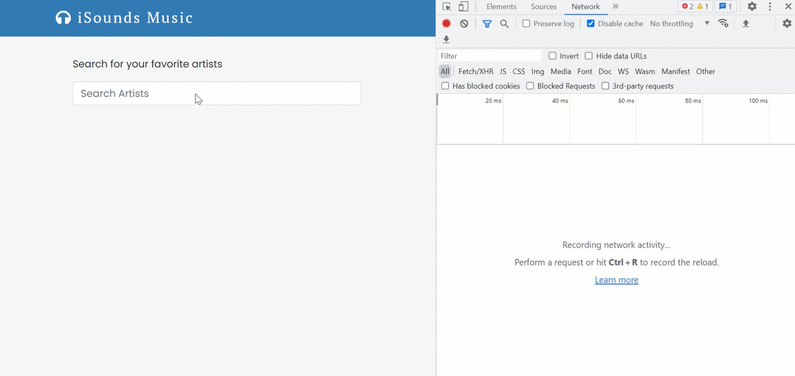
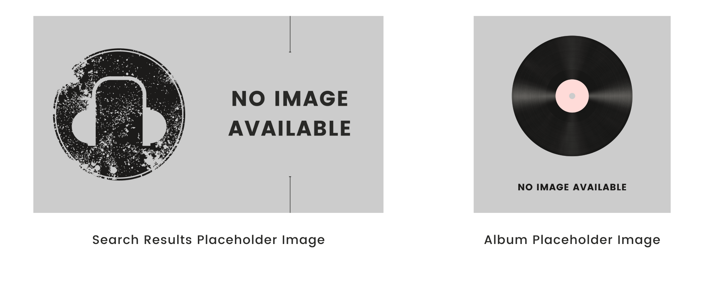
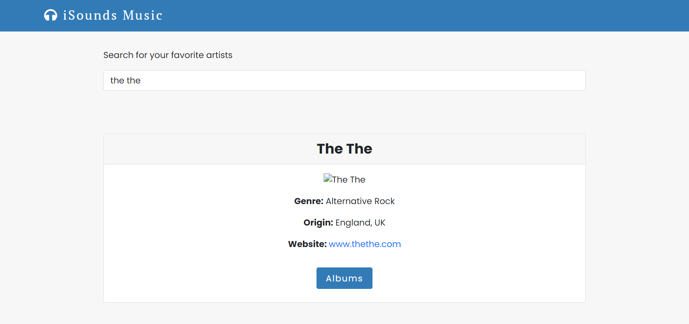
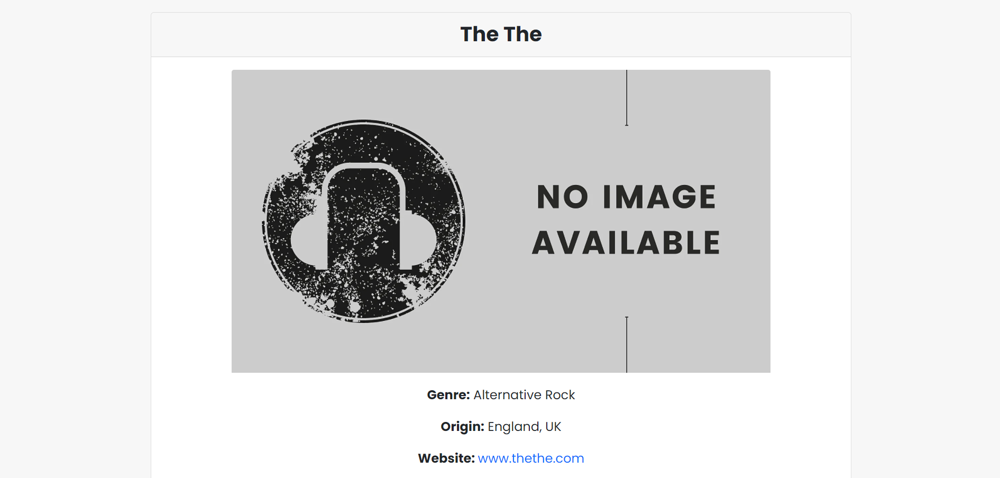
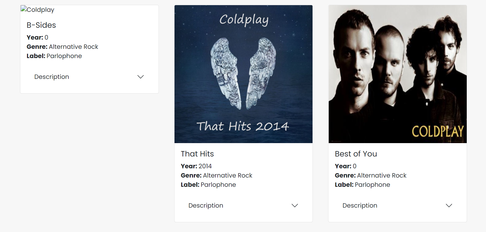
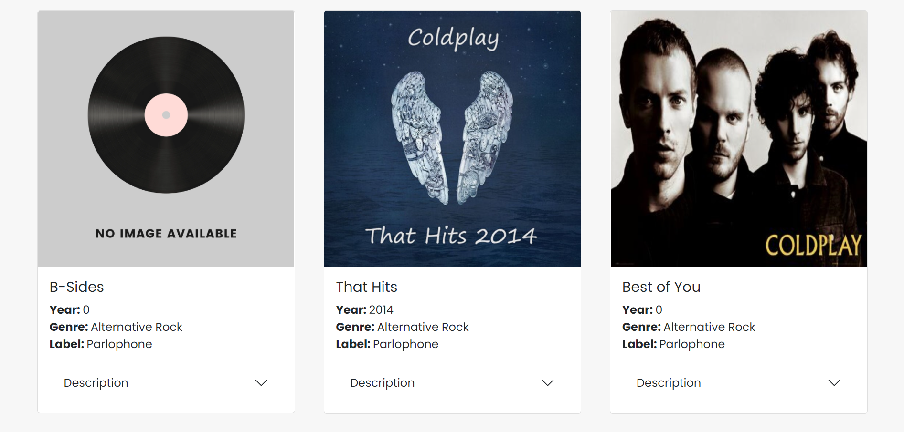
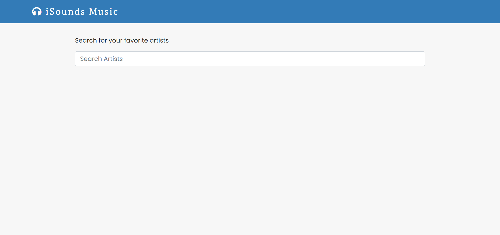
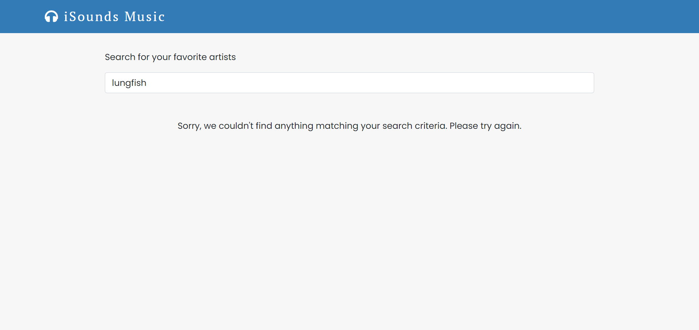
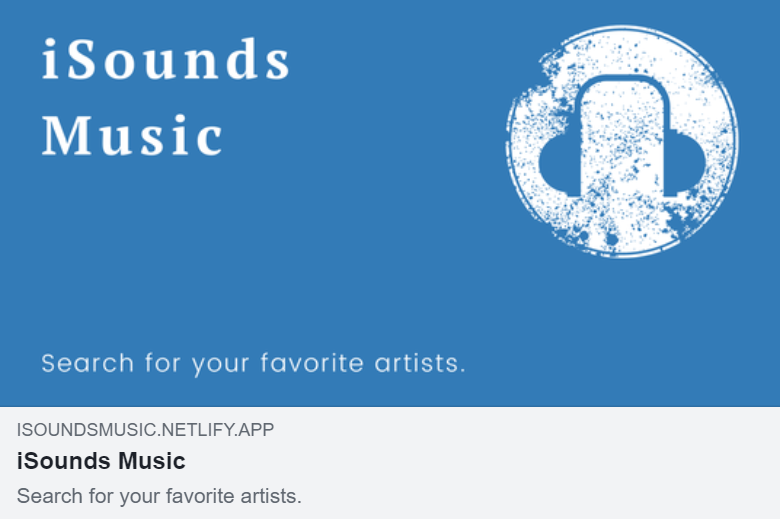
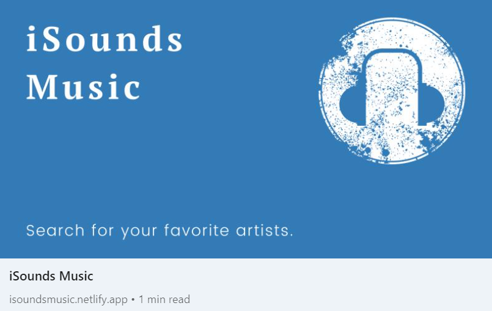

# iSounds Music


## Description

iSounds Music is a React application that allows you to search for your favorite artists. After searching for an artist, the user will be able to navigate to the artist's album page, which includes album information, such as album title, year the album was released, an image of the album cover, and more.

## iSounds Music Live Link

Please check out the live link for iSounds Music here: [iSounds Music](https://isoundsmusic.netlify.app/ "iSounds Music")

## Table of Contents
* [Technologies Used](#Technologies-Used)
* [Development](#Development)
* [Screenshots](#Screenshots)

## Technologies Used

* React (Hooks)
* React Router
* React Helmet
* React Bootstrap
* The AudioDB API
* CSS (CSS Modules)
* Google Fonts
* Font Awesome
* Facebook Developer Tools (Sharing Debugger)
* Canva
* Netlify

[Back To Top](#Table-of-Contents)

## Development

iSounds Music fetches data from [The AudioDB API](https://www.theaudiodb.com/api_guide.php "The AudioDB API"). Two different endpoints were used: one endpoint to fetch artist details by name, and a second to fetch album details from the artists. Dynamic routing was set up so that when a user goes to an artist's page to view the album information, only that artist's album information will show in its own page with its own route and `id` in the URL. In addition, React Helmet was set up in such a way that the browser tab will display the particular artist's name when the user goes to the artist's album page. For example, if a user searches for Tom Waits, and then goes to Tom Waits's album page, the browser tab will show: "iSounds Music | Albums | Tom Waits".

### Debouncing

To prevent API calls from being fired on every keystroke, a debounce custom hook is used in conjunction with the useEffect hook to delay the API call until the user finishes typing. This ensures that expensive operations, as in the API calls here, are not executed too frequently. The improvement can be seen when looking at the Network tab in the console when making the API calls. In this first example, debouncing is not used. As you can see, API calls are being made with every keystroke. This can be clearly seen in the Network tab. In addition to causing issues with performance, having new information appear with every keystroke can be chaotic and inefficient.


In comparison, you can see the improvement in the Network tab when debouncing is used. As you can see, although the same API call is being made (i.e., searching for "david bowie"), the API calls are not executed as frequently as when debouncing is not used. Instead of making API calls with every keystroke, the debounce hook forces the function that is fetching the data to wait a certain amount of time (500ms) before running again. The hook, then, limits the number of times the function is called. As you can see in the Network tab in the example below, this is much more efficient.



### Placeholder Images
Placeholder images were created using Canva to act as placeholders in cases were there are no images provided in the API, specifically images used in the search results and for album covers:



A search result with no image would look like this:



I didn't like how it looked when no image was available, so I decided to create my own placeholder images, as stated above. To use the created placeholder image when needed, I imported the image into my `ArtistResults` component, then used a ternary operator where I render the image to conditionally render the placeholder images in the case where no image is available in the API, where `PlaceholderImg` is the name given to my imported image:

```
<Card.Img
  src={ artist.strArtistWideThumb ? artist.strArtistWideThumb : PlaceholderImg }
  alt={artist.strArtist}
/>
```
The resulting search result with the placeholder image now looks like this:



Similarly, an album with no image looks like this on the page:



Again, a ternary operator was used with the imported placeholder image, this time in the `Artist` component:

```
<Card.Img
  src={item.strAlbumThumb ? item.strAlbumThumb : PlaceholderImg}
  alt={item.strArtist}
/>
```

And the resulting album information looks like this:



[Back To Top](#Table-of-Contents)

## Screenshots









[Back To Top](#Table-of-Contents)
